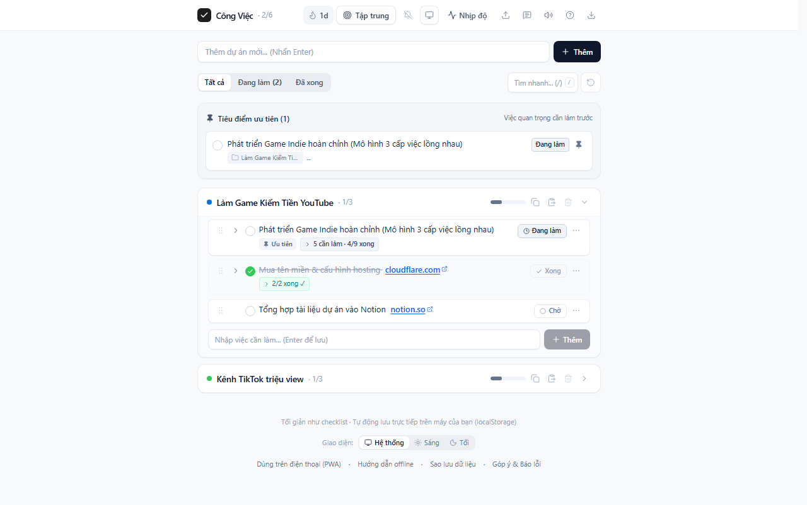
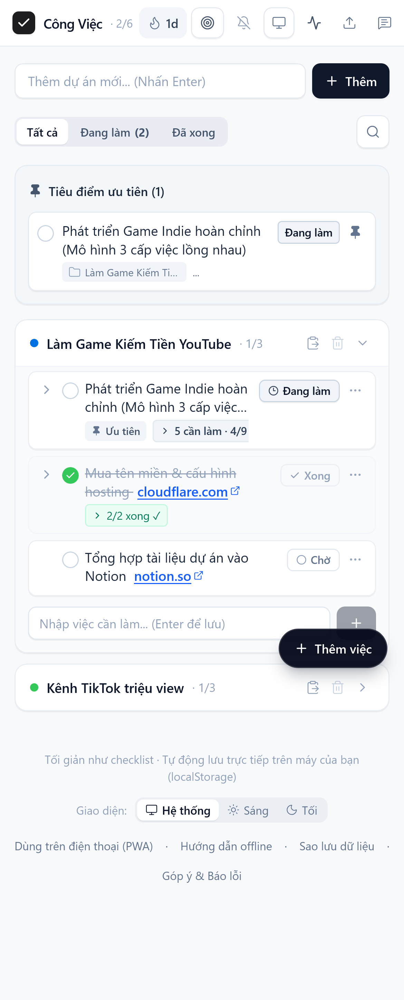

# Stride Tasks

<p align="left">
  
  
  
  
  
  
</p>

A minimal, local-first task and project manager engineered for deep work, recursive planning, and fast execution. It blends Notion-style nested subtasks, Linear-like status flow, and an Apple-inspired typography system into a browser-based workflow.

[**Explore Live Demo**](https://ais-pre-y4t5vvs2eiwpvtculhjqzi-954854445689.asia-southeast1.run.app) · [**Report Issue**](https://github.com/PhuccNguyen/stride-tasks/issues/new) · [**Architecture Documentation**](./ARCHITECTURE.md)

---

<p align="center">
  
</p>

---

## Why Stride Tasks

Productivity software should be calm, zero-friction, and durable. Instead of forcing solo builders into heavy cloud platforms with subscription lock-in, Stride Tasks keeps all computation and storage strictly local, eliminates input latency, and structures ambitious milestones into actionable recursive work units.

### Core Principles

- **Local-First by Default**: State persists strictly in browser storage (`localStorage`) and operates offline indefinitely.
- **Recursive Task Decomposition**: Large milestones expand into nested subtask trees with independent ordering.
- **Deterministic State Loop**: Clear status transitions (`todo` -> `doing` -> `done`) with instantaneous visual feedback.
- **Design Restraint**: Anti-slop visual discipline, zero unnecessary pills, clean typography, and a focused interface.

---

## Main Surfaces

### 1. Desktop Operational Dashboard
Compact operational view providing immediate access to project streams, subtask trees, and focus controls.

<p align="center">
  
</p>

### 2. Mobile Responsive Workflow
Optimized single-column interaction engineered for thumb-friendly management on mobile viewports and PWA home-screen installations.

<p align="center">
  
</p>

---

## Feature Matrix

### Task & Project Management
- Multi-project management with custom color indexing.
- Infinite recursive subtask tree with independent drag-and-drop reordering.
- Inline title editing with keyboard navigation (`Enter` to save, `Escape` to cancel).
- Dynamic progress calculation with two-way rollup and cascade completion.

### Activity Rhythm & Productivity Tracking
- Daily productivity heatmap tracking completion density across rolling weeks.
- Streak counter and record metrics for sustained work cadence.
- Filterable completion log (All, Today, This Week, This Month, or by Heatmap date).
- High-resolution (2x Retina PNG) card export and plain-text summaries for progress sharing.

### Privacy, Persistence & Offline Reliability
- Zero telemetry, zero external trackers, and zero server-side dependencies.
- One-click JSON backup export and schema-validated restore.
- Single-file standalone HTML export for offline portability.
- Progressive Web App (PWA) manifest support for native installation.

---

## Tech Stack

| Layer | Technology | Specification / Justification |
| :--- | :--- | :--- |
| **Framework** | React 19 | High-performance component composition |
| **Language** | TypeScript 5.7+ | Strict type checking and reliable refactoring |
| **Build Tool** | Vite 6 | Sub-second HMR and optimized production bundles |
| **Styling** | Tailwind CSS v4 | Utility-first architecture with modern CSS features |
| **Iconography** | Lucide React | Minimalist, consistent SVG icons |
| **Storage** | Browser LocalStorage | Zero-latency, client-side data persistence |

---

## Quick Start

### Prerequisites
- Node.js `>= 18.0.0`
- Package manager: `npm`, `pnpm`, or `bun`

### Installation

```bash
# 1. Clone repository
git clone https://github.com/PhuccNguyen/stride-tasks.git
cd stride-tasks

# 2. Install dependencies
npm install

# 3. Start local development server
npm run dev
```

Application will run locally at: http://localhost:3000/

### Build & Verification Commands

```bash
# Validate TypeScript contracts
npm run lint

# Build production bundle
npm run build
```

---

## Documentation

For technical specifications and internal guidelines:

- [ARCHITECTURE.md](./ARCHITECTURE.md)
- [docs/development/getting-started.md](./docs/development/getting-started.md)
- [docs/guides/user-guide.md](./docs/guides/user-guide.md)
- [docs/architecture/system-overview.md](./docs/architecture/system-overview.md)

---

## License

Distributed under the `MIT License`. Open source and free for personal and commercial usage.
